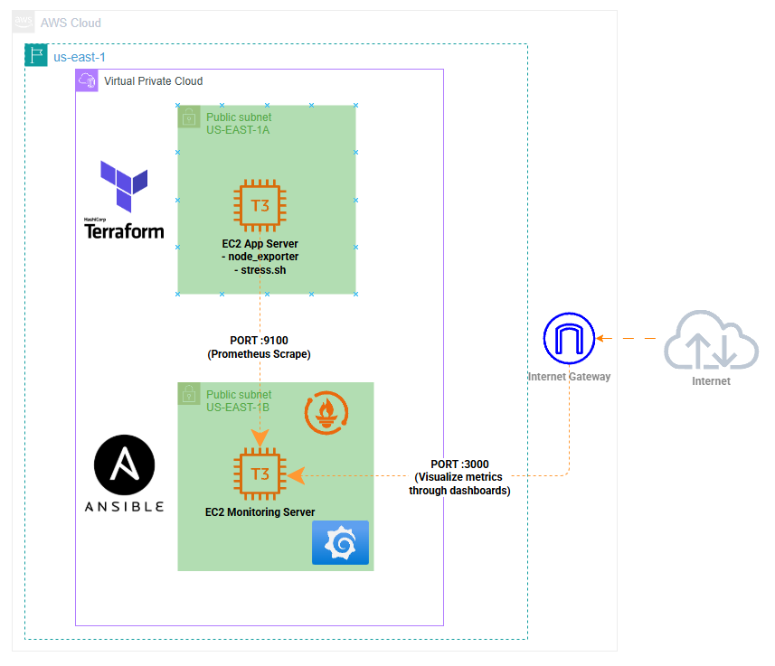

# Monitoring Stack with Terraform and Ansible

## Architecture



## Overview

Automated monitoring stack provisioned with Terraform and configured
with Ansible. Prometheus collects metrics from node_exporter running
on the application server, and Grafana visualizes the data through
pre-built dashboards.

## How it works

App Server (node_exporter:9100)
↓ scrape every 15s
Monitoring Server (Prometheus:9090)
↓ query
Grafana (port 3000) → dashboards

## Infrastructure (Terraform)

- VPC with 2 public subnets across 2 Availability Zones
- EC2 App Server (us-east-1a) — runs node_exporter and stress script
- EC2 Monitoring Server (us-east-1b) — runs Prometheus and Grafana
- Security Groups — port 9100 restricted to Monitoring Server only
- Internet Gateway

## Configuration (Ansible)

- App Server — installs node_exporter and stress script
- Monitoring Server — installs and configures Prometheus and Grafana

## Technologies Used

- Terraform — Infrastructure as Code
- Ansible — Configuration Management
- AWS (EC2, VPC, Security Groups)
- Prometheus — metrics collection
- Grafana — metrics visualization
- node_exporter — system metrics agent

## Prerequisites

- Terraform installed
- Ansible installed
- AWS credentials configured

## How to run

### 1. Provision infrastructure

```bash
cd terraform/
terraform init
terraform apply
```

### 2. Configure servers

```bash
cd ansible/
ansible-playbook playbook.yaml -i hosts.ini
```

### 3. Run stress test on App Server

```bash
# SSH into App Server
ssh -i key.pem ubuntu@EC2_APP_IP

# Run stress script
bash stress.sh
```

The script stresses CPU and RAM on the App Server,
generating real metrics visible in Grafana in real time.

### 4. Access Grafana

http://EC2_MONITORING_IP:3000
Default credentials: admin/admin

### 5. Import Dashboard

1. Go to Dashboards → Import
2. Enter dashboard ID: **1860** (Node Exporter Full)
3. Select Prometheus as datasource
4. Click Import

The dashboard provides real-time visualization of:

- CPU usage
- Memory usage
- Disk I/O
- Network traffic
- System load

## Project Structure

├── terraform/

│ ├── main.tf

│ ├── variables.tf

│ ├── outputs.tf

│ └── ...

├── ansible/

│ ├── hosts.ini

├── ansible.cfg

│ └── playbook.yaml

├── scripts/

│ └── stress.sh

└── README.md
